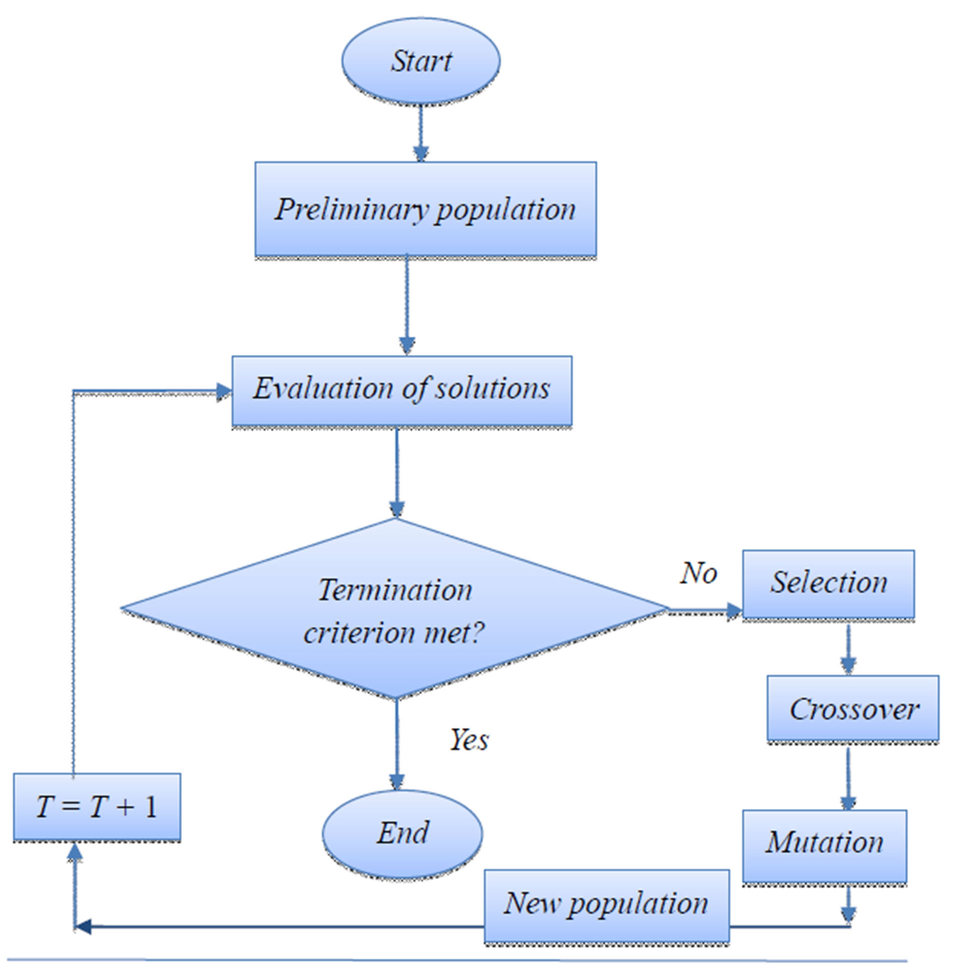

# One-max problem with a basic Genetic Algorithm

## Objectives

* Understand the structure of a basic GA

* Accustom oneself to the way EAs address problems

## Practical assignment

Often, when someone begins to learn a new programming language he implements the famous ``Hello World'' program. The equivalent to this in Evolutionary Computation is the one-max, a trivial problem often used to practice a new EC framework or algorithm. The problem is straitforward: Given a binary chromosome of size $n$, the goal is to maximize the number of ones, i.e., to get an all ones chromosomes. The fitness function is just the sum of ones.

Implement, with any programming language of your choice, a Genetic Algorithm (GA) that solves the one-max problem. Use the following pseudocode as guide.

```
n := Chromosome length
p := Population size
pm := Mutation probability

Initialize population with random values

While solution not found
	i := 0
	While i < p
		Select randomly two individuals in the population
		Compute their fitness
		Select fittest individual

		If random_number() < pm 
			Flip a random position of the selected individual

		Store individual in the next population

```

The following figure outlines the algorithm to implement.



(Image taken from [here](http://file.scirp.org/Html/1-8302163_41175.htm).)

Once the algorithm is implemented, perform the following tasks:

1. Show the best fitness found in each generation. Execute the algorithm. How does the best fitness evolve?
2. Compare the execution time with n=10, n=20 and n=100. (Hint: Use the Unix command *time*).

